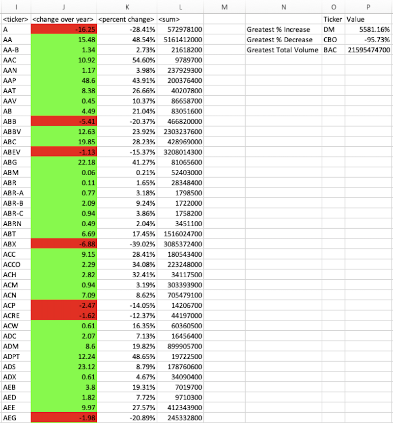

# VBA Stock Ticker Summary

### Summary | GRADE: A+
In this project, I was given a set of daily stock data including the ticker, opening and closing values. I used a VBA script to loop through the starter file and generate a topline summary, as shown below.

### Solution Writeup
(See the code contained in stock_ticker_vbacode.bas)

The first step in this project was declaring the necessary variables and variable types, and also assigning contant values for each column for easy access.

The rest of the project ins contained within a single For Loop that loops through every worksheet. For the first ticker, I manually assigned the value in A2. Then I reset all counters, summations, and new elements for each sheet, including setting labels, finding the number of rows through which to loop, and the counter variables which are unique to each sheet.

Once everything is set for the sheet, everything else is contained within another For Loop. The Loop checks the follwing ticker, and if it is the same it continues counting/summing the necessary variables. It also determines if the new row is the first day of that new ticker, to find the first and last days for the calculation between those two days. If the Loop finds a new ticker, it displays the collected summary information, and resets for the next ticker. 

Also within the move to the next ticker, there is a Loop that runs through the summary table. This checks for the stock with the greatest increase/decrease and then displays these metrics in a summary of the summay table. It also determines the conditional formatting, setting the cell as red for negative values and green for positive values. 

Lastly, there is a line formatting each sheet that adjusts column widths for easy viewing. 

You can run the code by copying stock_ticker_vbacode.bas into the Excel Developer tool. 
